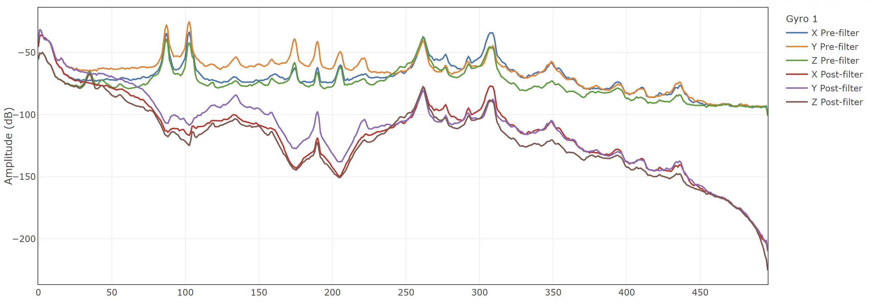
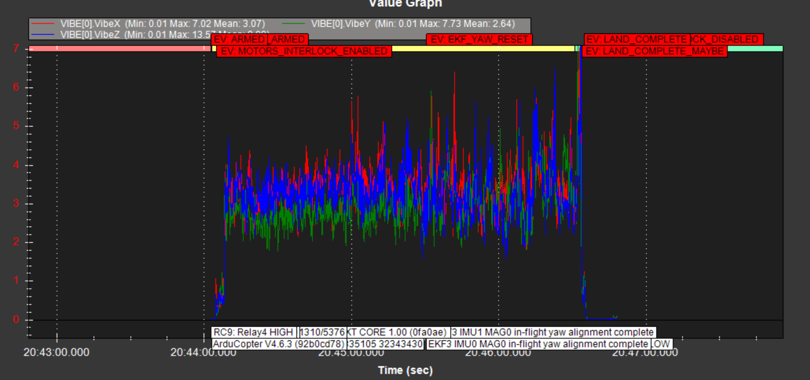
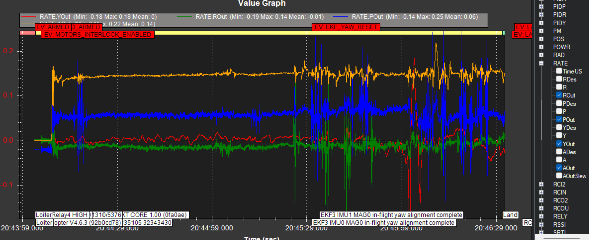
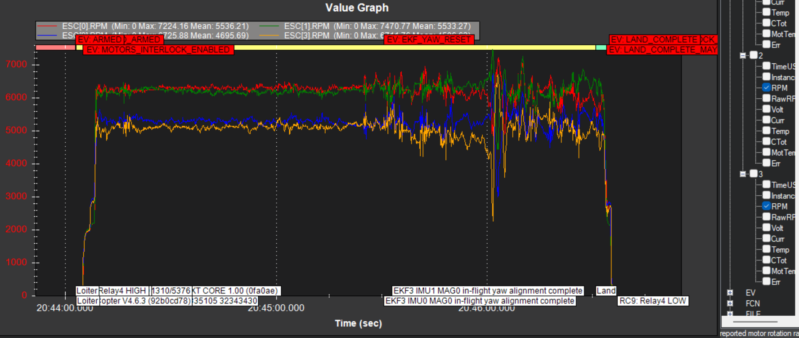
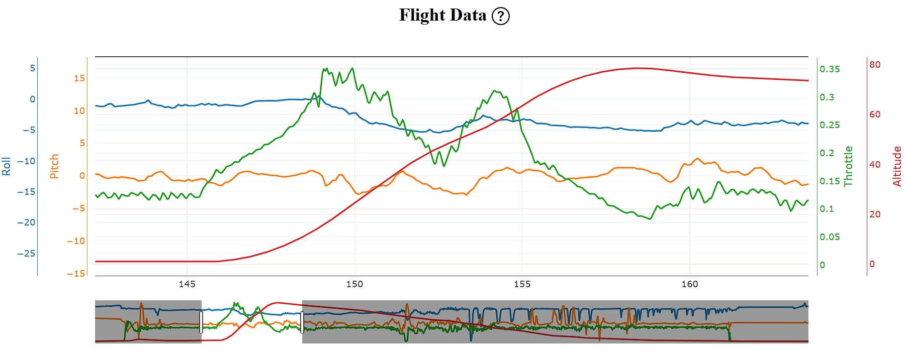

# ArduPilot configuration (Rekon10)

[Back to index](README.md) | [Flight platform hardware](flight-platform.md) | [Ground station / radio](ground-station.md)

FC-side settings for the **TBS Lucid H7** build. The FC is the source of truth; **[`config/rekon10-ardupilot.param`](config/rekon10-ardupilot.param)** is the last export committed from Mission Planner (**Write Params**, **Save to File**, then git) so the repo matches what was on the FC at export time.

Handset and ELRS profile (Boxer, rates, Model Match, switch table): **[ground-station.md](ground-station.md)**. EdgeTX model export: **[`config/MODELS/model01.yml`](config/MODELS/model01.yml)** (**Rekon10**, model id **10**).

Firmware: **Copter 4.6.3** `arducopter_with_bl.hex` for **TBS_LUCID_H7** from `https://firmware.ardupilot.org/Copter/stable-4.6.3/TBS_LUCID_H7/arducopter_with_bl.hex`.

## Frame

* `FRAME_CLASS = 1` (Quad)
* `FRAME_TYPE = 1` (X)

## Serial ports

Wiring: [flight-platform.md](flight-platform.md). Serial **`PROTOCOL`** / **`BAUD`** below match the last committed export.

| Port | Parameters | Wired |
|------|------------|--------|
| SERIAL0 | `PROTOCOL = 2`, `BAUD = 115` | USB |
| SERIAL1 | `PROTOCOL = -1` | Unused |
| SERIAL2 | `PROTOCOL = -1` (target) | Was M100 Pro; clear when F9P on SERIAL7 is sole GPS |
| SERIAL3 | `PROTOCOL = 42`, `BAUD = 115` | Walksnail MSP (TX3/RX3 only; VTX power is other FC pads, not UART3) |
| SERIAL4 | `PROTOCOL = 9`, `BAUD = 115` | Unused |
| SERIAL6 | `PROTOCOL = 2`, `BAUD = 460` | Matek ELRS R24-TD (see [ground-station.md](ground-station.md); `model01.yml` header `modelId` **10**) |
| SERIAL7 | `PROTOCOL = 5`, `BAUD` = bench (**A**) | Holybro F9P Rover Lite (UART + I2C compass) |
| SERIAL8 | `PROTOCOL = 16` | ESC ribbon |
| SERIAL9 | `PROTOCOL = 2`, `BAUD = 115` | Unused |

**SERIAL7:** Sole GNSS on the mast -- Holybro F9P Rover Lite. Set `SERIAL7_BAUD` from u-center bench (**A** in [rtk-integration-tracker.md](rtk-integration-tracker.md)); **460800** was the earlier SparkFun-breakout plan, not a promise for Rover Lite. Point `GPS1_COM_PORT` at this UART when params are re-exported.

### RTCM / RTK

Profile and headroom: [ground-station.md](ground-station.md), [rekon-design.md](rekon-design.md).

## ESC (AM32, Lucid 4in1)

Hardware and target name: [flight-platform.md](flight-platform.md#esc). ArduPilot side:

* **DShot:** [Pass-through](https://ardupilot.org/copter/docs/common-blheli32-passthru.html) to **AM32** (web **[am32.ca](https://am32.ca/)** or desktop) requires the autopilot to use a **DShot** motor protocol (**`MOT_PWM_TYPE`**, not normal PWM). Without DShot, you may get a link to the configurator but **not** reliable per-motor access.
* **Passthrough:** **`SERVO_BLH_AUTO = 1`** turns on pass-through for outputs already set as **Motor1..Motor4** (**`SERVO1_FUNCTION`**..**`SERVO4_FUNCTION`** on a quad). Reboot after changing **`MOT_PWM_TYPE`** / **`SERVO_BLH_AUTO`**. Follow the wiki order: props **off**, flight battery **on**, safety switch as configured, **disconnect Mission Planner** (USB stays), then open the ESC tool.
* **Telemetry:** The **TBS FC--ESC harness** includes a **UART** to the FC as **`SERIAL8`** (**`SERIAL8_PROTOCOL = 16`** ESC telemetry in the export; **`SERIAL8_BAUD`** typically **115** = 115200). That line is for **telemetry** (and passthrough to AM32), separate from the **four DShot** motor command paths in the same harness.
* **Bench alternative:** Mission Planner **Initial Setup** / **Optional Hardware** / **Motor Test** (props off, follow prompts) to check spin order and direction once checks allow.

NOTE: Once you remap the servo/motor mappings using SERVO1_FUNCTION - SERVO4_FUNCTION, that changes the order IN THE AM32 CONFIGURATOR as well as in ardupilot. (We are connecting through the FC passthrough so the actual ESC we are talking to is changed as a result of that mapping.) If you try to treat the AM32 as using the physical numbering from the ESC you will be VERY confused.


### Choices (flight impact, not just passthrough)

**`MOT_PWM_TYPE`** sets how the FC drives the ESCs **on every armed flight**, not only during AM32 sessions. **Normal PWM** (**0**) avoids DShot but breaks the [passthrough](https://ardupilot.org/copter/docs/common-blheli32-passthru.html) workflow and is a poor match for **AM32** on this stack. **DShot** gives digital throttle commands (no classic PWM endpoint calibration), predictable timing, and access to ESC tooling.

| Choice | Recommendation | Why |
|--------|----------------|-----|
| DShot rate | **DShot600** first; **DShot300** if you ever see ESC sync or noise issues | **600** is the usual default for **4in1** + AM32: fast enough for control, widely stable. **300** is slightly more conservative on marginal wiring. |
| **`SERVO_BLH_AUTO`** | **1** while using the AM32 / BLHeli passthrough path; **0** for day-to-day flight once ESC settings are saved | **AUTO** gates **passthrough** to the PC; **DShot** itself comes from **`MOT_PWM_TYPE`**, not from this flag. |
| Motor direction | **`SERVO_BLH_RVMASK`** in ArduPilot **or** direction in AM32 (not both fighting) | Same physics as BF: wrong direction means wrong torque in stabilize. Fix before props on. |
| **Pole count** | **`SERVO_BLH_POLES`** = your **motor** pole count (export shows **14** -- confirm on the motor datasheet) | Wrong poles skew **eRPM** / telemetry and **harmonic notch** if fed from ESC RPM. |
| RPM into ArduPilot | **Default: UART only** -- **`SERIAL8`** ESC telemetry. Keep **`SERVO_BLH_BDMASK = 0`** | **Bi-directional DShot** is an **optional** alternate RPM path on the motor wires; you do **not** need it if UART telemetry works. Avoid turning on **both** without a reason. **`INS_HNTCH_ENABLE`** is **0** in export until you have ESC RPM in logs ([IMU harmonic notch](https://ardupilot.org/copter/docs/common-imu-notch-filtering.html) is post-hover tuning). |

**Design record:** **`MOT_PWM_TYPE`** = **DShot600** (baseline). RPM for logging / notch from **`SERIAL8`** unless you later prove UART is insufficient and switch deliberately. Re-export **`rekon10-ardupilot.param`** after changes.

All **`MOT_PWM_*`**, **`SERVO_BLH_*`**, **`SERIAL8_*`**, motor **`SERVO*_*`**: **[`config/rekon10-ardupilot.param`](config/rekon10-ardupilot.param)**.

## RC and FC aux mapping

**Which switch maps to which RC channel** (and EdgeTX **`destCh`** indexing): **[ground-station.md](ground-station.md)** and **[`config/MODELS/model01.yml`](config/MODELS/model01.yml)**. This section is **FC parameters only** -- no duplicate of the RadioMaster / EdgeTX mix table.

**Why Land on SD, not RTL:** much of this flying is **under canopy** and near **structure**. **RTL** means climb-then-go-home and is **actively dangerous** in that environment unless you have planned for **open sky**, a **safe home**, and **clearance above obstacles**. **SD** / **CH7** is **Land** only (**`RC7_OPTION = 18`**). Use **RTL** only when you have explicitly chosen that path (for example open-field work or a failsafe policy you have deliberately set and tested), not as the default "get out" on this switch.

| Channel | FC parameters |
|---------|-----------------|
| CH5 | **`RC5_OPTION = 153`** (arm/disarm on latch **L3**; gate and mixes in [ground-station.md](ground-station.md) / **`model01.yml`**) |
| CH6 | **`FLTMODE_CH = 6`**. **`FLTMODE1` / `FLTMODE4` / `FLTMODE6`** = **Loiter (5) / AltHold (2) / Sport (13)** toward-to-away on **SB** ([ground-station.md](ground-station.md)). |
| CH7 | **`RC7_OPTION = 18`** (**LAND Mode** on **SD**; [aux functions](https://ardupilot.org/copter/docs/common-auxiliary-functions.html)). |
| CH8 | **`RC8_OPTION = 30`** (*Lost vehicle sound*: **GEPRC** / FC buzzer **while CH8 is high**, i.e. while **SF** is held for the arm gate). |
| CH9 | **`RC9_OPTION = 36`** (Relay4). **`RELAY4_PIN = 83`**, **`RELAY4_FUNCTION = 1`** (Lucid HD VTX BEC). **`RELAY4_DEFAULT = 0`** so the VTX BEC is **off at power-up** (bench work with the radio off leaves the VTX cold); CH9 / **SA** still switches it on for flight. |

**VTX default-off at boot:** **`RELAY4_DEFAULT`** is the relay's startup state (**0 = Off, 1 = On, 2 = No change**). Set to **0** so a bench power-up with **no radio** leaves the VTX unpowered instead of energizing it (was **1**). With the radio on, CH9 controls Relay4 as before -- you must switch the VTX on before flight. **Polarity not yet bench-verified this session:** confirm `RELAY4_DEFAULT = 0` with `RELAY4_INVERTED = 0` actually leaves the BEC de-energized (power up radio-off, check the goggles see no VTX). **`RELAY2_DEFAULT` / `RELAY3_DEFAULT`** (pins 81/82) are still **1** and undocumented here -- left alone, but they also come up energized at boot.

### ELRS telemetry on the radio

Telemetry keys and screens live in **`model01.yml`** (e.g. **RSNR**, **FM**, RSSI/LQ fields). [ground-station.md](ground-station.md) describes the ELRS profile and handset setup.

## Compass and GPS (Holybro F9P Rover Lite)

* `GPS1_TYPE` / `GPS1_COM_PORT` / `SERIAL7_*`: match bench and FC wiring ([rtk-integration-tracker.md](rtk-integration-tracker.md)).
* `COMPASS_*`: integrated compass on the F9P I2C bus; `COMPASS_ORIENT` after outdoor cal (**E**). M100-era **Yaw270** / `COMPASS_ORIENT = 6` in export is **historical** only.

**Wall clock / RTC:** Do not rely on ArduPilot learning UTC from this GNSS path alone (same class of issue as M100 bench -- [flight-platform-build-log.md](flight-platform-build-log.md)). Payload cameras use the shared **DS3234** SQW PPS ([arm-pods.md](arm-pods.md), [central-hub.md](central-hub.md)); steering that RTC from GNSS time when fixes are good is a separate integration task.

## Battery monitoring

Mission Planner **Initial Tune** (with **6S Li-ion** selected) set most **`BATT_*`** metering and voltage thresholds. Full **`BATT_*`** / **`MOT_BAT_*`** list: **[`config/rekon10-ardupilot.param`](config/rekon10-ardupilot.param)**.

**Failsafe actions (operator choice, not Initial Tune):** **`BATT_FS_LOW_ACT = 0`** (warn only on low pack) then **`BATT_FS_CRT_ACT = 1`** (**Land** on critical). Low uses **`BATT_LOW_VOLT`** with **`BATT_LOW_TIMER`** (**10** s hold in export) before the warning state; critical uses **`BATT_CRT_VOLT`**.

**From the current export (Initial Tune thresholds):** **`BATT_ARM_VOLT = 19.1`**, **`BATT_LOW_VOLT = 18.6`**, **`BATT_CRT_VOLT = 18`** (about **3.18 / 3.10 / 3.00 V per cell** on **6S**). Those are a **reasonable first pass** for Li-ion; **`BATT_CRT_VOLT = 18`** is toward the **low** end for sustained load on some packs. If the FC hits **critical Land** earlier than you expect under sag, raise **`BATT_CRT_VOLT`** slightly (and re-export) rather than fighting it in the air.

## Rangefinder (future)

**Not fitted.** Plan: **Benewake TFS20-L** on **I2C1**, address **0x10**:

```
RNGFND1_TYPE = 45
RNGFND1_ADDR = 16
RNGFND1_MIN_CM = 20
RNGFND1_MAX_CM = 1500
RNGFND1_ORIENT = 25
```

UART fallback if I2C fails: `RNGFND1_TYPE = 8` at 115200 on SERIAL4. [ArduPilot TFS20-L doc](https://ardupilot.org/copter/docs/common-benewake-tf02-lidar.html).

## Mission Planner and other tools

* **Accel / level cal:** Lucid **"V"** on pad side **up**. [flight-platform-build-log.md](flight-platform-build-log.md).
* **Compass cal:** Onboard F9P compass after mast mount (tracker **E**).
* **ELRS RX:** Match Boxer (**3.6.3** per [ground-station.md](ground-station.md)). [ExpressLRS web flasher](https://expresslrs.github.io/web-flasher/).
* **Walksnail VTX:** Match goggles (e.g. **39.44.5**).
* **AM32 ESC:** **## ESC (AM32, Lucid 4in1)** above; [AM32 firmware repo](https://github.com/am32-firmware/AM32).

### Pre-arm: Mission Planner UI vs ArduPilot (Copter)

Mission Planner **Initial Setup** / **wizard** text is **shared across vehicle types** and often mentions **ailerons**, **elevator**, **rudder**, or other **fixed-wing** steps. **Ignore that** for this **Copter** quad -- it is not your checklist.

**What actually blocks arming** comes from **ArduPilot Copter**, not that screen. With USB or telemetry connected:

* **Flight Data** tab -- **Messages** (or the scrolling message area on the HUD). Look for **`PreArm:`** / **`Arm:`** / **`STATUSTEXT`** lines (GPS, EKF, compass, RC cal, battery, throttle, fence, etc.). While disarmed, failing checks are often repeated about every **30 s** (see [Pre-Arm Safety Checks](https://ardupilot.org/copter/docs/common-prearm-safety-checks.html) -- message/cause/solution table for **Copter**).

**Checks:** **`ARMING_CHECK`** bitmask; **`ARMING_SKIPCHK`** is for bench only -- [doc](https://ardupilot.org/copter/docs/common-prearm-safety-checks.html#disabling-the-pre-arm-safety-check).

## Tuning

### Logs

HQProp 3-bladed props were fine with the default tune, the only downside was a "chirp" on certain attitude changes. This is the 5/29 6pm flight.

Airscrew 2-bladed props showed substantial oscillation in stabilize mode, visible and audible. This is the 5/31 morning flight.

Reverting INS filter settings to [this commit](https://github.com/symmatree/fables/commit/7553a7698d2c789b8b7906041552deec3c3070be) got me back to slightly chirpy flight, still with the two-bladed prop. This is the 5/31 afternoon flight.

----

Subsequent 2-bladed flight lost control and crashed; follow-up (perhaps with
loose prop) spin in flat circles until it completely augured in and broke a
2-bladed prop, so we're back to the 3-bladed HQProp ones again.

----

26-06-08

Steady hover flight, althold and loiter:

* Checked RATE outputs for oscillation per [methodic](https://ardupilot.github.io/MethodicConfigurator/TUNING_GUIDE_ArduCopter.html#711-check-for-motor-output-oscillation)
* Ditto the RATE Des (desired) no visible oscillations
* The ESC RPM values are pretty clean, they hunt up and down a little but it doesn't look like oscillation as such.
* Motor temps seem fine; starting around 35 degrees and slowly going up to 50C (122F)
* One weird thing: two motors are about 5300 RPM and two are at maybe 6100. I suspect this is fore/aft imbalance forcing uneven speeds to stay level.
* PM group: Zero long loops, rock solid at 400 Hz main loop rate.
* VIBE: VibeX is 3-6, VibeY is 2-5. VibeZ is 3-6 except a big spike at touchdown during landing. The guidance from [methodic docs](https://ardupilot.github.io/MethodicConfigurator/TUNING_GUIDE_ArduCopter.html#81-notch-filter-calibration) is 

> According to common ArduPilot forum knowledge, and quoting @xfacta:
> Vibrations over 30 are very bad
> Vibrations over 20 are causing issues even if you don’t know it yet
> Vibrations over 15 are in a grey area - it could go either way - check clipping, it must be zero
> Vibrations below 10 are good



> Use as little notch filter bandwidth and attenuation as possible. Noise levels below -50dB are considered good enough. Do not use notch filters to reduce noise below that level as it introduces unwanted signal lag.

So we start below 50 dB except for a couple of spikes, and after filtering we are substantially below. We could probably drop the second set of notches and only do the primary harmonic but maybe not. Anyway our out of the box filter
on first and second harmonic does just fine.

### Single Notch, Loop rate

Switching to a single notch but increasing to evaluate a loop rate (updating the notch at 400 Hz rather than at 200 Hz or something) is still really nice and hopefully lower latency. It held up with some control twitches - at roughly the same total energy input, but twitching the loiter target back and forth horizontally, and commanding a flat spin. Gemini argues for a vertical climb test to get the RPM up into the 15k range where the primary motor harmonic would overlap with its guess of a 250 Hz and 310 Hz frame resonance (based on the higher motor harmonics being smeared out somewhat below and above their natural rates).



Very low; under 10 was simply "good" with no further comment, versus nuanced descriptions above that.



No oscillation visible in the rates, you can clearly see my commanded twitches in the second half of the flight. 



Still a systemic gap between (0, 1) and (2, 3) which I think is just an off-center weight fore and aft.


-----

QuickTune pass one. Strictly reduced a few values from the initials.
Checked in as commit 27edae822d4aea576cf6c345b62af4b5aa400256. Was a pretty
still day but the failure mode from not enough wind is supposed to be too aggressive a tuning not too cautious a one, so I think this is reasonably clean. I suspect what happened is that it tried to increase each one, decided it was a failure, and dropped by the target percentage which ended up slightly below where it started. which I'm fine with.

Note that it didn't really "do" anything, basically just hovered there, whined a little, and moved on with updates in Messages.

----

Autotune cycle 1:

### Roll

Tests:

* The resulting ATC_ANG_RLL_P parameter value is smaller than 4.5
* The resulting ATC_RAT_RLL_D parameter value is equal to the AUTOTUNE_MIN_D parameter value (AUTOTUNE_MID_D = 0.0005)

Results

* ATC_ANG_RLL_P,18.37906 (up from 4.5)
* ATC_RAT_RLL_D,0.004112592 (up from 0.0031)
* ATC_RAT_RLL_I,0.08487533 (down from 0.101)
* ATC_RAT_RLL_P,0.08487533 (down from 0.101)
* ATC_ACCEL_R_MAX,127035.2 up from 116700

Both Roll checks pass, D is 10x the min value, no reason to disbelieve this.


----

### Vertical bounce

I refuse to call it a "punchout". Attempted settings: 
max v accel to 2.5 m/s2 and max speed at 10 m/s, so it would wind up to full throttle.
Over 12s it climbed from 1m to 78.5m, average speed of 6.45 m/s.
Throttle rose from 0.12 to a peak of 0.35 about halfway through the climb, then I backed out of it then rolled back in to a second peak of 0.31. Last 18m or so of climb were after the throttle was dropping quickly toward idle.



Over just that climb period, the motor fundamental frequency rose to peaks of ~154 Hz and then 148 Hz on the second lower spike, from a hover at about 100 Hz. Notch tracks the noise really nicely. The second harmonics are visible but dimmer. It seems like there's more distributed noise until the throttle starts to climb, then it converges on a few sharper lines.

VibeX got up to 15 a few times but no clipping.

Limited to just the climb period where the rising throttle swept the fundamental frequency up 50 Hz, post-filter noise highest peak is -75 dB, oddly for the Y channel in particular. So even during this aggressive climb it was still at quite desirably low levels of noise.

### Pitch tuning

I completed this but switched modes before landing, which seems to have lost it. I could recover
it from the logs I think, or I'll just re-run in the still air tomorrow morning if it doesn't rain.

Second iteration:

* ATC_ACCEL_P_MAX,138192.4 from 116700
* ATC_ANG_PIT_P,23.45685 from 4.5
* ATC_RAT_PIT_D,0.004828416 up slightly from 0.0035
* ATC_RAT_PIT_I,0.04900767 down from 0.10125
* ATC_RAT_PIT_P,0.04900767 down from 0.10125

This sets off none of their red flags in [the section](https://ardupilot.github.io/MethodicConfigurator/TUNING_GUIDE_ArduCopter.html#952-pitch-axis-autotune). They say the quality of the tune is proportional to the ATC_ANG_RLL_P, ATC_ANG_PIT_P, and ATC_ANG_YAW_P parameters for their respective axis and that's the 23.4, so I won't worry that RAT I and P are less than for roll. This could also just reflect that it's much easier to roll than to pitch, just from the weight distribution.

---

### Yaw tuning

ATC_ANG_YAW_P is barely over their 4.5 cap but I'm okay with that. other values tightened up.

probably should rerun but not now. I ran YawD for giggles, it also set some values.

### Retune and overall

It all seems fine? final values aren't the defaults and aren't on the limits for all of them, so nominally it converged. I'm not sure that the "raise X% until oscillation and then drop Y%" doesn't produce a systematic drift if you repeat it, but that's fine.

## EKF3 source mixing (altitude and vertical velocity)

Verified against ArduPilot source (`AP_NavEKF3_PosVelFusion.cpp`, `AP_NavEKF_Source.cpp`).

**Altitude position (`EK3_SRC1_POSZ`) -- hard mutex.** `selectHeightForFusion()` is a strict `if / else if` chain that sets exactly one `activeHgtSource` per tick. Only one sensor's measurement feeds the EKF altitude correction at any moment. Options: `1` = Baro (default), `3` = GPS, `2` = RangeFinder, `6` = ExtNav/VIO. If the active source drops out (GPS timeout, range out of range, etc.) it falls back to Baro automatically. There is no "blend baro and GPS altitude based on quality" path -- pick one.

**Vertical velocity (`EK3_SRC1_VELZ`) -- can fuse multiple simultaneously.** `useVelZSource()` returns true for any source that appears in any of the three source sets (SRC1/2/3) when `EK3_SRC_OPTIONS` bit 0 (`FUSE_ALL_VELOCITIES`) is set. Current config: `EK3_SRC1_VELZ = 3` (GPS), `EK3_SRC_OPTIONS = 1`. GPS vertical velocity is already fused, gated by `EK3_GPS_VACC_MAX = 0.15 m` (reject GPS VelZ when reported VACC exceeds 0.15 m).

**To add VIO vertical velocity alongside GPS:** set `EK3_SRC2_VELZ = 6` (ExtNav). With `SRC_OPTIONS = 1` already set, both GPS VelZ and VIO VelZ will fuse simultaneously, each weighted by their noise parameters. VIO VelZ requires an active ExtNav source; if it goes stale the EKF silently drops it and continues on GPS alone.

**Barometer propwash offset.** In-flight analysis of loiter-around (2026-06-19) shows BARO reads ~1.2 m higher than GPS-normalized altitude during hover, converging toward zero as throttle drops on descent. Cause: low-pressure region under the props inflates the barometer. The offset is systematic (not random noise) and tracks throttle, with std ~0.5 m across the flight. `EK3_ALT_M_NSE = 2.0` accommodates this within the EKF noise budget. Switching `EK3_SRC1_POSZ` to GPS would trade the propwash bias for GPS vertical noise; at RTK float/fixed quality that is likely a better trade for precision altitude work. `EK3_GPS_VACC_MAX` would then gate when GPS altitude is accepted (the same threshold already gates GPS VelZ).