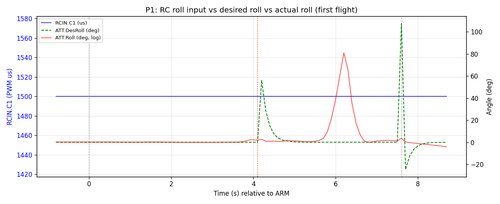
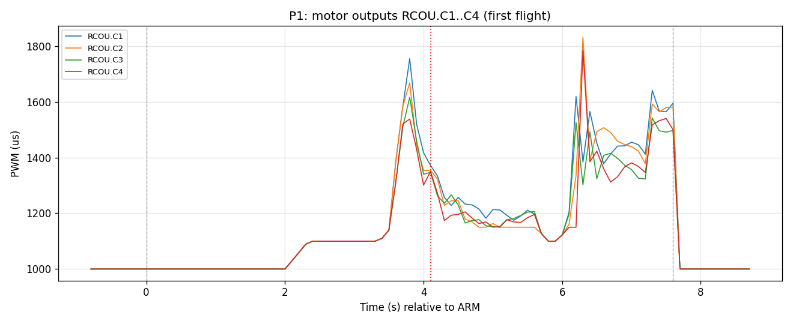
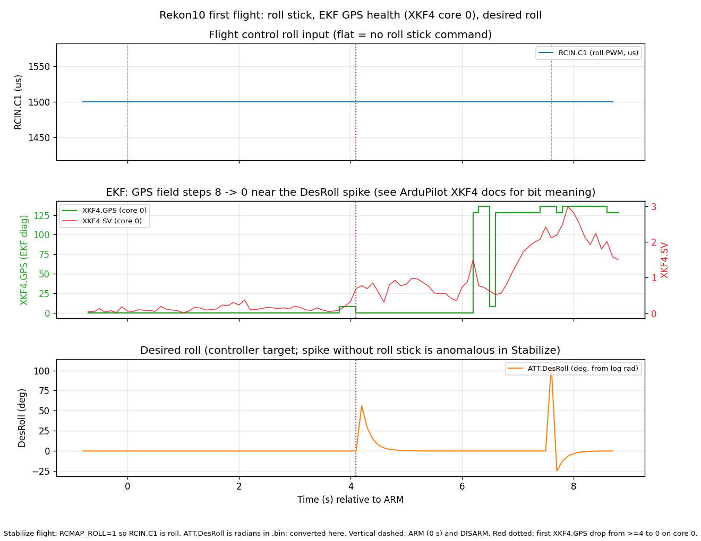

# Telemetry and logging (Rekon10)

Long-form telemetry topology, bench validation, and task notes for the Rekon10. Index and dependency graph: Cursor plan `~/.cursor/plans/rekon10_post-first-flight_debrief_033b686b.plan.md`.

---

## P1 First-flight log analysis

**Log file (FC DataFlash):** `1980-01-12 14-29-50.bin` -- **Mission Planner** download name reflects **unset RTC** on the FC, not wall time. **Flight date (operator):** **2026-04-19**. A copy is committed as [`attachments/logs/rekon10-first-flight_1980-01-12_14-29-50.bin`](attachments/logs/rekon10-first-flight_1980-01-12_14-29-50.bin) (**~2.2 MB**). **Firmware** on the log: **ArduCopter 4.6.3** (**TBS Lucid H7**).

**Plots (plan items plus EKF overlay):**

**Supplementary** (roll stick, **`XKF4` GPS/SV**, **`DesRoll`** for the EKF step discussion):

**Text extract:** [`attachments/logs/p1-raw.txt`](attachments/logs/p1-raw.txt) -- **`mavlogdump.py`** on **`RCIN`**, **`ATT`**, **`RATE`**, **`GPS`**, **`MSG`**, **`EV`**, **`MODE`**, **`ARM`**, **`RCOU`**, **`XKF4`** (**~1.3 MB**).

**Regenerate plots:** from repo root, `cd fables/Drones/rekon10/scripts && .venv/bin/python plot_first_flight_roll_ekf_desroll.py` (after `python3 -m venv .venv && .venv/bin/pip install -r requirements-p1-plot.txt`). Pass **`--bin`** if the `.bin` is not at the default WSL path.

**Decode `XKF4` `SS`/`TS`:** `scripts/decode_xkf4_ss_ts.py --bin ../attachments/logs/rekon10-first-flight_1980-01-12_14-29-50.bin --core 0`

### PreArm and boot `MSG` text before first ARM (verbatim)

These **`MSG`** strings appear **in time order before** the first **`ARM` `ArmState` 1** at **`TimeUS` 148683236**:

- `ArduCopter V4.6.3 (92b0cd78)`
- `ChibiOS: 88b84600`
- `TBS_LUCID_H7 00390045 35335105 32343430`
- `Param space used: 890/5376`
- `RC Protocol: None`
- `RCOut: DS600:1-4 PWM:5-13`
- `New mission`
- `New rally`
- `New fence`
- `Frame: QUAD/X`
- `GPS 1: probing for u-blox at 230400 baud`
- `PreArm: GPS 1 still configuring this GPS`
- `GPS 1: u-blox navigation rate configuration 0x1FF3`

**Later on the same log file (after the midair disarm, craft **on the lawn** while retrieving it):** `PreArm: Accels inconsistent`, `PreArm: Check mag field (xy diff:265>100)`, and again `PreArm: Check mag field (xy diff:232>100)` -- **not** part of the chain immediately before that first outdoor arm, but kept for **P7** baseline.

### Verdict (plan categories)

- **Pilot roll/pitch input:** **Ruled out** for the sharp bank -- **`RCIN.C1`** and **`C2`** stay on trim while **`DesRoll`** spikes and **`Roll`** later diverges.
- **Mode oddity:** **Ruled out** for this hop -- **`MODE` `ModeNum` 0 (Stabilize)** for the armed segment, **no change** in flight.
- **Motor saturation alone:** **Not** the lead explanation -- see **`RCOU`** plot; the **attitude / EKF** story leads.
- **External disturbance vs estimator / GNSS path:** **Inconclusive between those two alone**, with **strong timing evidence** that the **`XKF4` `GPS` scalar** (filter GPS status, not **`SS`**) and **`SV`** move in the **same era** as the large **`DesRoll`** spike. **Decoded `SS`** is richer; see **next subsection**. **Not** a clean pilot over-reacted-on-roll story.

Full narrative (DVR, **`VIBE`**, multi-axis **`Des`**, GNSS **`NSats` / `HDop`** over the armed window) lives in [flight-platform-build-log.md](flight-platform-build-log.md) under **First flight (2026-04-19)**.

### `XKF4` **`SS`** (solution status) and **`TS`** (timeout) over time

**Why this matters:** [ArduPilot logmessages `XKF4`](https://ardupilot.org/copter/docs/logmessages.html) documents **`SS`** as a **bitmask** of named flags (**`USING_GPS`**, **`GPS_GLITCHING`**, **`GPS_QUALITY_GOOD`**, **`DEAD_RECKONING`**, **`TAKEOFF_EXPECTED`**, etc.). That is the **structured** counterpart to **PreArm `MSG` strings** -- same class of evidence, different channel. **`TS`** lists **sensor timeout** bits (position, velocity, height, mag, airspeed, drag).

**How it was decoded:** bit names and values follow the **Copter** logmessages table; script-driven pass over **`rekon10-first-flight_1980-01-12_14-29-50.bin`**. Full transition list: [`attachments/logs/p1-xkf4-ss-ts-transitions.txt`](attachments/logs/p1-xkf4-ss-ts-transitions.txt).

**`TS`:** Stays **`48`** for every **`XKF4`** sample in this log on both cores -- **`timeout_ARSP`** + **`timeout_DRAG`** (airspeed / drag timeouts; copter without those sensors still carries the bitmask). **No change** across arm, flight, or disarm -- **not** the story here.

**`SS` changes (EKF cores 0 and 1 match):**

| Approx time (rel. ARM) | What changed in `SS` | `XKF4.GPS` scalar (same row) |
|------------------------|----------------------|------------------------------|
| Just after ARM (~+0.1 s) | **`TAKEOFF_EXPECTED` set** (+2048) -- baro takeoff compensation | 0 |
| ~**+4.0 s** (in armed flight) | **`TAKEOFF_EXPECTED` cleared** | **8** at the transition sample |
| **After DISARM** (~+8.0 s wall; **~0.4 s after** `TimeUS` disarm) | **`GPS_GLITCHING` set** (+16384) | 136 |
| On the lawn after crash (~+14--15 s; log still running while walking over to collect) | **`GPS_QUALITY_GOOD` cleared** | still elevated |

**Takeaways:**

1. During the **armed 7.6 s hop**, the only **`SS`** motion is **on/off of `TAKEOFF_EXPECTED`** (paired with the takeoff phase) and the **`GPS` scalar** moving -- **not** the **`GPS_GLITCHING`** bit. **`USING_GPS`** and **`GPS_QUALITY_GOOD`** stay **set** in **`SS`** through the flight **per decode**.
2. **`GPS_GLITCHING` in `SS`** turns on **after** the craft is already **disarmed** (same second as the **`MSG`** line **GPS Glitch or Compass error** in the tumbling era). That is **not** the same as saying the **DesRoll spike at ~+4 s** was driven by the **`GPS_GLITCHING` SS bit** -- it was **not** set yet.
3. This fills the gap vs **PreArm:** we now have **both** verbatim **`MSG`** (above) **and** a **full `SS`/`TS` timeline** for the EKF lanes.

### Surprises (for downstream tasks)

- **`DesRoll` and `DesPitch`** both move at the spike with **opposing sign**; **`DesYaw`** in **`ATT`** is **heading (deg)**, not the same kind of quantity as roll/pitch lean -- compare carefully to **`RATE`** or **RC yaw** if you need yaw **rate**.
- **`ATT.Roll`** to **~81 deg** while **`DesRoll`** is back near **zero** -- **body attitude** not tracking **commanded lean**.
- Second large **`DesRoll`** transient **at disarm** (controller / motor-stop era, not stick).
- **`GPS` `NSats`** over the armed segment spans **10--17**; **`HDop`** spans **1.82--4.02**.
- **`XKF4` `SS`:** **`GPS_GLITCHING`** appears **after disarm**, not during the **~+4 s** spike; **`TAKEOFF_EXPECTED`** toggles with takeoff and clears at **~+4 s** when the **`GPS` scalar** moves.

---

## P6 GPS bench validation (M100 Pro, u-center2)

**Bench chain:** FT232H -> known-good pigtail -> **new JST 4-pin plug** -> M100 Pro pigtail -> M100 Pro. FC validation stays in **P7** (SERIAL2 GPS on the Lucid stack).

### What we actually saw (2026-04-19)

**u-center2 (Windows, current install):** Main UI **`interface: unknown`**. **Configuration Send** and UBX **Enable / Disable / Poll** (including for **NAV-PVT**) are **greyed**; this session did not use those controls. The log still decodes **UBX-NAV-PVT at 10 Hz** on the bench link. **MON-VER** was read once; text captured below.

**Same session, beyond u-center2 menus:** The unit **ACKs** other traffic in the tool's indicators, but **VALGET does not populate** and **enabling messages does not change what flows**. Recorded as-is for P7; no separate root-cause pass here.

**Baud:** **115200** on the ArduPilot side is already how the Rekon10 stack is set (**`SERIAL2_BAUD = 115`** with GPS on **SERIAL2**). The module presents **UBX-NAV-PVT at 10 Hz** on the bench path; nothing in this write-up re-opens baud as an open question.

### MON-VER (verbatim capture)

| Field | Value |
|-------|--------|
| `swVersion` | ROM SPG 5.10 (7b202e) |
| `hwVersion` | 000A0000 |
| Extensions | `FWVER=SPG 5.10`, `PROTVER=34.10`, `GPS;GLO;GAL;BDS SBAS;QZSS` |

No separate **`MOD=`** line appeared in the UI capture.

### Working model for this module (bench + FC planning)

Firmware behaves as **minimal host-facing UBX**: steady **UBX-NAV-PVT at 10 Hz**, **MON-VER** for identification, and **little or no effective CFG / VALGET** from the paths we tried. That is enough for stacks that only need a **PVT stream** at a known baud. A full u-center2 / textbook u-blox **CFG** workflow is not the right expectation for this unit.

The original P6 **u-center2 checklist** (MON-COMMS, MSG toggle ACK, VALSET bake-in, `.ubx` export, and so on) is **dropped**: the tool **cannot** drive CFG on this link, and the module **does not** expose the scripted readbacks. That procedure was written for a cooperative u-blox + u-center2 pair; **this bench session is not that**.

### Bench takeaway (not a u-center2 scorecard)

- **JST + UART path:** Continuous **UBX-NAV-PVT at 10 Hz** through the new plug chain is **consistent with a good physical link** for the data the FC actually needs first.
- **ArduPilot next step (P7, not guessed here):** With **`GPS_AUTO_CONFIG = 0`**, stop asking the FC to **push** a full u-blox autoconfig sequence against a module that does not behave like a textbook responder; then judge **fix, HDOP, STATUSTEXT, and Loiter pre-arm** on the real **SERIAL2** wiring. Whether Loiter arms is **unknown until that run**; that is normal troubleshooting, not a missing promise from this section.

**No `GPS1_TYPE` change is required** for the argument above: the stack already showed **3D fix** with detection as-is.

---

## P2 OSD/SRT replay

Stub for Task P2. Content to be filled when walksnail-osd-tool runs are captured.

---

## P3 Telemetry scaffold reference (SR6)

Stub: SR6 bandwidth budget and lean `SR6_*` proposal live in the plan body until merged here under a dedicated reference heading.

---

## P4 UDP MAVLink over WiFi

Stub for Task P4.

---

## P5 USB telemetry

Stub for Task P5.

---

## P7 GPS reinstall and FC verification

Stub for Task P7. Do not reinstall the GPS on the FC until P6 verdict is green.

---

## P8 OSD screens on P3

Stub for Task P8.

---

## P9 Switch bug, logging tiering, build log

Stub for Task P9.

---

## P10 Tooling inventory

Stub for Task P10.
