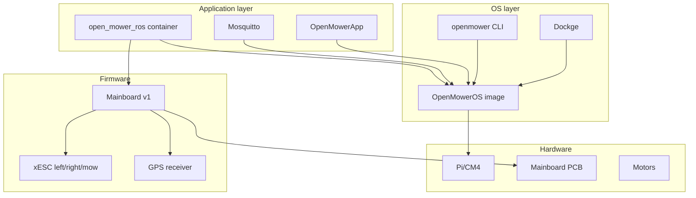

# OpenMower v1 Stack: Architectural Summary

This document summarizes the v1 OpenMower stack layers, every configurable or updatable piece, how to identify current versions, and where an "indeterminate" mixed state can show up. It is the reference for the next step: assessing current versions on the robot and choosing a target state (old vs new release).

Sources: [openmower-os-stack.md](openmower-os-stack.md), [openmower-docs-summary.md](openmower-docs-summary.md).

---

## 1. Stack Layers (v1)

| Layer | Components | Notes |
|-------|------------|------|
| **Hardware** | Raspberry Pi (or CM4), mainboard PCB, xESCs, GPS module, motors, sensors | v1 = full-size Pi + YardForce-style mainboard (0.9.x–0.13.x). |
| **Firmware** | Mainboard (v1: OpenMower repo `Firmware/`), xESC (VESC config only; no separate "firmware update" in docs), GPS (e.g. ZED-F9P HPG 1.51, u-center config) | Mainboard firmware selected by `.env` FIRMWARE (e.g. 0_13_X). xESC: configure via VESC Tool. |
| **OS** | OpenMowerOS image (pi-gen, Debian Trixie arm64), Dockge, openmower-cli, web terminal, comitup hotspot, Docker | Identity in `/usr/share/openmoweros/version.*`. |
| **Application** | open_mower_ros (Docker image), Mosquitto, OpenMowerApp | ROS image tag from `.env` VERSION; started via Dockge or `openmower start`. |

---

## 2. Configurable or Updatable Pieces

For each component: what can be configured or updated, and how to identify current versions.

### 2.1 OS (OpenMowerOS image)

| What | Where / How | How to identify |
|------|-------------|------------------|
| Entire OS image | Reflash SD (or eMMC) with image from [OpenMowerOS releases](https://github.com/ClemensElflein/OpenMowerOS/releases). | On device: `cat /usr/share/openmoweros/version.txt` or `version.json` / `version.yaml` (display_version, git describe, build_time_utc). |
| Hostname | `raspi-config` -> System Options -> Hostname; or first-boot / Imager. | `hostname -f`; also written into `/opt/stacks/openmower/.env` HOSTNAME by dockge.service. |
| User | Fixed `openmower` (DISABLE_FIRST_BOOT_USER_RENAME=1 in pi-gen). | N/A. |
| WiFi / network | Comitup hotspot (OpenMower-&lt;n&gt;), then http://10.41.0.1; or Raspberry Pi Imager custom settings. | NetworkManager; check with `nmcli` or UI. |
| Expand filesystem | Sometimes needed after first boot: `raspi-config` -> Advanced -> Expand Filesystem. | `df -h /`. |

### 2.2 Application (containers and params)

| What | Where / How | How to identify |
|------|-------------|------------------|
| open_mower_ros image tag | `/opt/stacks/openmower/.env`: `VERSION=latest` or `x.y.z` or `edge`. After change: Dockge "Update" or `openmower pull`, then restart. | `.env` file; `docker images ghcr.io/clemenselflein/open_mower_ros`; `docker inspect` on running container. |
| Mower model, hardware, firmware variant | `/opt/stacks/openmower/.env`: `MOWER`, `HARDWARE_PLATFORM`, `FIRMWARE`, `ESC_TYPE` (v1). | Read `.env` (via Dockge "Edit" or SSH). |
| ROS / mower params | `/home/openmower/params/mower_params.yaml` (and custom_params for CUSTOM). Edit: `openmower configure ros`. | File contents; `openmower configure ros` opens editor. |
| Map (areas, docking) | `/home/openmower/ros/map.json` (docs also mention `ros_home/map.json`; confirm on device). | Backup: copy file; delete map: remove map.bag + map.json, restart. |
| Debug logging | `.env`: `DEBUG=True` or `False`. | `.env`. |
| OpenMowerApp | Image `ghcr.io/clemenselflein/openmowerapp:latest` in compose; no version pin in default compose. | `docker images`; compose.yaml. |
| Mosquitto | Image and config at `/opt/stacks/openmower/mosquitto.conf`. | compose + volume mount. |

### 2.3 Mainboard firmware (v1)

| What | Where / How | How to identify |
|------|-------------|------------------|
| Firmware variant | `.env` `FIRMWARE` (e.g. 0_13_X, 0_12_X_LSM6DSO, …). Must match mainboard revision and IMU. | `.env`; docs: [openmower.de/docs/versions](https://openmower.de/docs/versions/) and archive v1.0.2. |
| Update mainboard (v1) | openmower-cli firmware/update commands (legacy path; exact command set depends on HARDWARE_PLATFORM). v2: `openmower update-firmware` (and `update-bootloader` if timeouts). | Version may be reported by ROS or tooling; check docs and OpenMower repo Firmware/ for v1. |
| OpenOCD / xCore (v2) | Stage 45-openocd installs OpenOCD + xcore.cfg for flashing xCore over GPIO. v1 uses different mainboard (no xCore). | N/A for v1. |

### 2.4 xESC

| What | Where / How | How to identify |
|------|-------------|------------------|
| ESC type (v1) | `.env` `ESC_TYPE` (e.g. xesc_mini, xesc_mini_w_r4ma, xesc_2040). | `.env`. |
| Configuration | No firmware "update" in docs; configuration only. Stop ROS: `openmower stop`; expose: `openmower expose-xesc [left|right|mower]`; VESC Tool via TCP (e.g. openmower:65102). | VESC Tool; motor/app XML. |

### 2.5 GPS

| What | Where / How | How to identify |
|------|-------------|------------------|
| Receiver config | Ardusimple F9P: u-center, HPG 1.51, save to Flash. UM9xx: serial commands. | u-center / serial; ROS params for baud, protocol, datum. |
| ROS GPS params | `openmower configure ros`: gps/baud_rate, gps/protocol, gps/datum_lat, gps/datum_long; NTRIP in ntrip_client.*. | `mower_params.yaml`; NTRIP client config. |
| RTK fix | Monitor in OpenMowerApp or `rostopic echo /ll/position/gps` (flags: 3 = RTK fix). | App; ROS topics. |

---

## 3. Where "Indeterminate State" Can Show Up

You had an older OS/software mix and replaced some Docker images with your own for GPS troubleshooting. The following are the main places that can be inconsistent and what to inspect first.

| Area | What to inspect | What "indeterminate" means here |
|------|------------------|----------------------------------|
| **OS vs docs** | `/usr/share/openmoweros/version.*` (display_version, git describe). | Old image (e.g. pre–v2.x or CustomPiOS-era) vs current OpenMowerOS v2.x; different stage layout and no Dockge/openmower CLI. |
| **.env** | `/opt/stacks/openmower/.env`: VERSION, HARDWARE_PLATFORM, MOWER, FIRMWARE, ESC_TYPE. | VERSION pointing to a custom or old tag; HARDWARE_PLATFORM or FIRMWARE mismatch with actual hardware. |
| **Running ROS image** | `docker ps` / `docker inspect` for `open_mower_ros`; image tag and digest. | Container from a different registry or tag than `.env` (e.g. your own image for debugging). |
| **Params** | `/home/openmower/params/mower_params.yaml`; optional custom_params. | Params from an older schema or from a different mower type; GPS/NTRIP settings for a different setup. |
| **Compose file** | `/opt/stacks/openmower/compose.yaml`. | Modified compose (extra services, different image names, or volume mounts) vs stock OpenMowerOS. |
| **Mainboard firmware** | .env FIRMWARE; possible version from ROS or openmower-cli. | Firmware variant not matching mainboard/IMU (e.g. wrong 0_xx_X); or outdated firmware (see v1 errata: Outdated Firmware, IC2 chip). |
| **GPS** | ROS topic `/ll/position/gps`, OpenMowerApp GPS quality, NTRIP/client config in params. | GPS lock but not holding: antenna, NTRIP base, datum, or firmware/config mismatch. |

**Suggested inspection order (on device via SSH or browser terminal):**

1. `cat /usr/share/openmoweros/version.txt` (or version.json) — OS identity.
2. `cat /opt/stacks/openmower/.env` — VERSION, HARDWARE_PLATFORM, MOWER, FIRMWARE, ESC_TYPE.
3. `docker ps -a` and `docker images | grep open_mower` — which ROS image is actually used.
4. `openmower status` (if CLI present) — stack state.
5. Params: `ls -la /home/openmower/params` and spot-check `mower_params.yaml` (gps, ntrip_client, datum).
6. If GPS is the issue: follow [openmower-docs-summary.md](openmower-docs-summary.md) GPS-RTK troubleshooting (u-center, NTRIP, rostopic, map.json path).

---

## 4. Next Steps (version assessment and target state)

From here you can:

1. **Document current state:** Record OS version, .env, image tag/digest, and param highlights (and optionally mainboard/firmware if discoverable).
2. **Choose target:** Stay on current (or older) release for stability, or move to latest OpenMowerOS + latest open_mower_ros image (with v1 compatibility and errata in mind).
3. **Plan the path:** Reflash SD with a known OpenMowerOS image; or update in place (pull new image, align .env and params). For v1, also check [openmower.de/archive/v1.0.2/docs](https://openmower.de/archive/v1.0.2/docs) and errata (Outdated Firmware, IC2 chip, rain sensor cable).

This architecture doc and the two discovery summaries (OS stack + docs) are the inputs for that plan.
